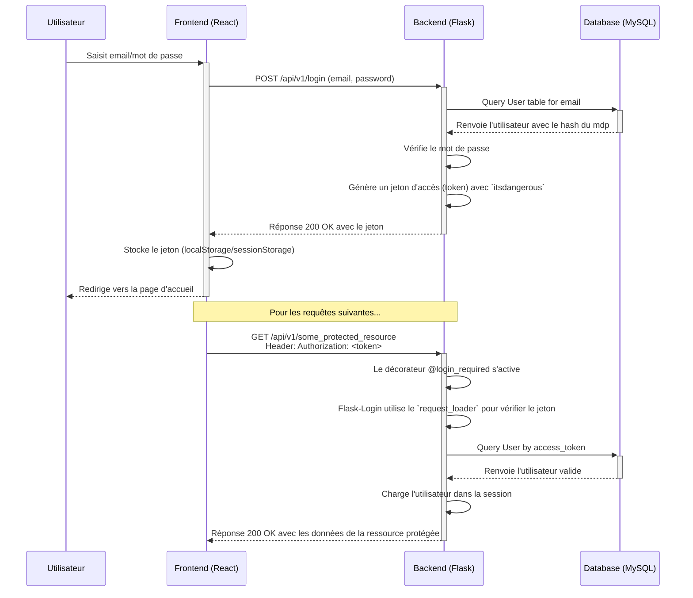

# Analyse du Flux d'Authentification

Ce document détaille le mécanisme d'authentification actuel de RAGFlow et fournit des pistes pour l'intégration d'un système de Single Sign-On (SSO).

## Flux d'Authentification Actuel par Jeton (Token)

L'authentification est basée sur des jetons (tokens) générés par le backend et stockés par le frontend. Le processus est orchestré par Flask-Login, mais utilise une approche sans état (stateless) via des jetons plutôt que des sessions serveur traditionnelles.

### Diagramme de Séquence

### Étapes Clés du Processus

1.  **Connexion Initiale**: L'utilisateur fournit ses identifiants au frontend. Le frontend les envoie au backend via une requête POST.
2.  **Validation & Génération du Jeton**: Le backend vérifie les identifiants en base de données (MySQL). Si c'est correct, il utilise la bibliothèque `itsdangerous.URLSafeTimedSerializer` pour créer un jeton sécurisé et horodaté qui contient l'identifiant de l'utilisateur.
3.  **Stockage du Jeton**: Le frontend reçoit ce jeton et le stocke localement (par exemple, dans le `localStorage` du navigateur).
4.  **Authentification des Requêtes Suivantes**: Pour chaque requête ultérieure vers une ressource protégée, le frontend ajoute un en-tête HTTP `Authorization` contenant le jeton.
5.  **Vérification Côté Backend**: Sur le backend, la fonction `load_user` (définie dans `api/apps/__init__.py` et enregistrée avec `@login_manager.request_loader`) est automatiquement appelée par Flask-Login. Elle décode le jeton, vérifie sa validité et son expiration, puis récupère l'utilisateur correspondant en base de données. Si tout est correct, l'utilisateur est "connecté" pour la durée de cette requête.

## Pistes pour l'Implémentation du SSO (OAuth2 / OIDC)

Intégrer un SSO (par exemple avec Google, Azure AD, ou un fournisseur OIDC comme Keycloak) suivrait un schéma différent, souvent le flux "Authorization Code".

### Étapes d'un Flux SSO

1.  **Initiation**: Sur la page de connexion, l'utilisateur clique sur "Se connecter avec [Fournisseur]".
2.  **Redirection**: Le frontend redirige l'utilisateur vers la page de connexion du fournisseur d'identité (ex: Google), en passant des paramètres comme le `client_id` et une `redirect_uri` qui pointe vers le backend RAGFlow.
3.  **Authentification Externe**: L'utilisateur s'authentifie auprès du fournisseur externe.
4.  **Code d'Autorisation**: Le fournisseur redirige l'utilisateur vers la `redirect_uri` du backend, en incluant un `code` d'autorisation à usage unique dans l'URL.
5.  **Échange du Jeton**: Le backend reçoit ce code. Il effectue alors un appel direct (serveur à serveur) vers le fournisseur d'identité, en lui envoyant le `code`, son `client_id` et son `client_secret`. En retour, il reçoit un `access_token` et un `id_token`.
6.  **Gestion de l'Utilisateur**: Le backend utilise l'`id_token` pour obtenir les informations de l'utilisateur (email, nom, etc.).
    - Il cherche si un utilisateur avec cet email existe déjà dans sa base de données (`User`).
    - Si l'utilisateur n'existe pas, il le crée (provisionnement "Just-In-Time").
    - Si l'utilisateur existe, il le met à jour si nécessaire.
7.  **Création de la Session RAGFlow**: Une fois l'utilisateur identifié ou créé dans RAGFlow, le backend génère son propre jeton d'accès (comme dans le flux actuel) et le renvoie au frontend.
8.  **Finalisation**: Le frontend reçoit le jeton RAGFlow et l'utilise pour toutes les requêtes suivantes, exactement comme dans le flux de connexion par mot de passe.

### Modifications à Prévoir

-   **Backend**:
    -   Créer un nouveau Blueprint dans `api/apps/auth/` pour gérer les routes de callback SSO (ex: `/api/v1/auth/callback/google`).
    -   Utiliser une bibliothèque cliente OAuth comme `Authlib` pour simplifier les interactions avec le fournisseur d'identité.
    -   Adapter le modèle `User` et le service `UserService` pour gérer la création et la liaison de comptes externes.
-   **Frontend**:
    -   Ajouter un bouton "Se connecter avec [Fournisseur]" sur la page de connexion.
    -   Le clic sur ce bouton doit rediriger vers l'endpoint du backend qui initie le flux SSO (ou directement vers le fournisseur d'identité). 