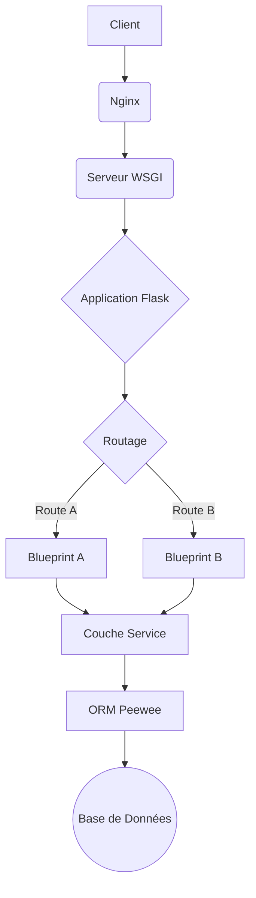

# Architecture du Backend

Le backend de RAGFlow est construit en utilisant le micro-framework Python **Flask**. Il sert une API RESTful consommée par le frontend et fournit toute la logique métier de l'application.

## Technologies et Frameworks Clés

- **Framework Web**: [Flask](https://flask.palletsprojects.com/) est le framework principal utilisé pour construire l'application web. Il est léger et extensible, avec des Blueprints utilisés pour organiser l'application en composants plus petits.
- **Serveur WSGI**: [Werkzeug](https://werkzeug.palletsprojects.com/) est utilisé comme serveur de développement WSGI.
- **ORM (Object-Relational Mapper)**: [Peewee](http://docs.peewee-orm.com/en/latest/) est utilisé pour interagir avec la base de données. Il supporte à la fois MySQL et PostgreSQL. Le code est conçu pour être agnostique à la base de données.
- **Authentification**: L'authentification est gérée par `Flask-Login` et est basée sur des jetons. Les jetons sont générés à l'aide de la bibliothèque `itsdangerous`.
- **Documentation de l'API**: [Flasgger](https://github.com/flasgger/flasgger), une extension Flask pour Swagger UI, est utilisé pour générer automatiquement la documentation de l'API, qui est accessible à l'endpoint `/apidocs/`.
- **Gestion des Tâches Asynchrones**: Le système utilise des threads Python natifs pour certaines tâches en arrière-plan (comme `update_progress`) avec des verrous distribués gérés via Redis.

## Structure du Projet (`api/`)

Le code du backend est principalement situé dans le répertoire `api/`.

- `ragflow_server.py`: Le point d'entrée principal pour démarrer le serveur. Il initialise l'application Flask, la base de données et les autres services.
- `apps/`: Ce répertoire contient les différentes applications (Blueprints) de Flask.
  - `__init__.py`: C'est ici que l'instance principale de l'application Flask est créée et configurée. Il découvre et enregistre dynamiquement les Blueprints.
  - `*_app.py`: Chaque fichier se terminant par `_app.py` définit un Blueprint Flask, encapsulant un ensemble de routes associées.
- `db/`: Contient tout le code lié à la base de données.
  - `db_models.py`: Définit le schéma de la base de données à l'aide des modèles Peewee. Il inclut des tables pour les utilisateurs (`User`), les tenants (`Tenant`), les bases de connaissances (`Knowledgebase`), les documents (`Document`), les dialogues (`Dialog`), etc.
  - `services/`: Contient la logique métier pour interagir avec les modèles de la base de données (par exemple, `UserService`, `DocumentService`).
- `settings.py`: Fichier de configuration pour l'application.
- `utils/`: Fonctions et classes utilitaires utilisées à travers le backend.

## Cycle de Vie d'une Requête Backend

Pour bien comprendre l'organisation du code, il est utile de visualiser le parcours d'une requête HTTP depuis le client jusqu'à la base de données.

1.  **Client & Nginx**: Le client envoie une requête. Nginx, agissant en tant que reverse proxy, la reçoit et la transmet au serveur d'application approprié.
2.  **Serveur WSGI (Werkzeug)**: Werkzeug écoute les requêtes transmises par Nginx et les formate pour qu'elles soient compréhensibles par Flask.
3.  **Application Flask**: C'est le cœur du backend. L'instance principale de Flask reçoit la requête.
4.  **Routage**: Flask analyse l'URL de la requête et, grâce aux Blueprints qui ont été enregistrés, détermine quel endpoint de quel Blueprint doit la traiter.
5.  **Blueprint**: Le code de la route spécifique est exécuté. Typiquement, cette logique de vue est légère. Elle valide les entrées et appelle la couche de service pour effectuer les actions métier.
6.  **Couche Service (`api/db/services/`)**: Cette couche contient la logique métier principale. Par exemple, `UserService.create_user()` contiendrait la logique pour créer un nouvel utilisateur. Elle n'interagit pas directement avec la base de données mais passe par l'ORM.
7.  **ORM Peewee (`api/db/db_models.py`)**: La couche de service utilise les modèles Peewee pour effectuer des opérations CRUD (Create, Read, Update, Delete). L'ORM traduit les appels de méthode Python (ex: `User.create(...)`) en requêtes SQL.
8.  **Base de Données (MySQL)**: La requête SQL est exécutée et le résultat remonte la chaîne jusqu'au client.

## Modèle de Données (Peewee)

L'ORM Peewee est utilisé pour mapper les objets Python aux tables de la base de données. Les modèles de données clés incluent :

- `User`: Gère les informations des utilisateurs et l'authentification.
- `Tenant`: Permet une architecture multi-tenant, où chaque tenant a sa propre configuration pour les LLMs, les utilisateurs, etc.
- `Knowledgebase`: Le cœur de la fonctionnalité RAG, représentant une collection de documents.
- `Document`: Un document unique au sein d'une base de connaissances.
- `Dialog`: Définit une application de chat, y compris ses invites et ses paramètres de LLM.
- `UserCanvas`: Représente un "canevas" où les utilisateurs peuvent construire des workflows d'agents complexes à l'aide d'un DSL.

## Points d'extension possibles

- **Ajout de SSO**: Pour ajouter le SSO, on pourrait créer un nouveau Blueprint Flask dans `api/apps/auth/` (un répertoire similaire à `github.py` ou `oauth.py`). Il faudrait intégrer une bibliothèque comme `Flask-Dance` ou une autre bibliothèque cliente OAuth/OIDC. Le modèle `User` devrait probablement être étendu pour lier les comptes SSO aux utilisateurs de RAGFlow.
- **Personnalisation de la langue**: Le modèle `User` a déjà un champ `language`. L'API pourrait utiliser cette information pour renvoyer des réponses localisées. Cela nécessiterait probablement l'utilisation d'une bibliothèque d'internationalisation (i18n) comme `Flask-Babel`. 