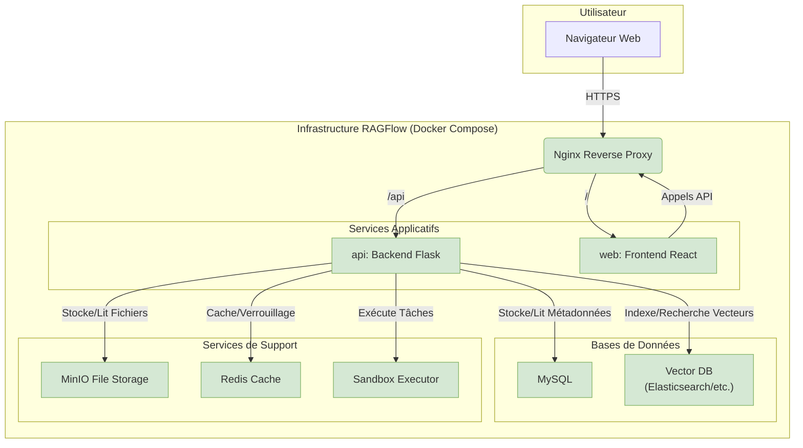

# Infrastructure, Déploiement et Configuration

L'architecture de RAGFlow est basée sur un ensemble de microservices conteneurisés avec Docker. Cette approche permet une meilleure scalabilité, isolation et maintenabilité des différents composants. La configuration et l'orchestration de ces services sont principalement gérées par `docker-compose` pour le développement local et `Helm` pour les déploiements sur Kubernetes.

## Diagramme d'Architecture des Services

Le diagramme ci-dessous illustre les principaux services qui composent RAGFlow et leurs interactions.

## Description des Services

Chaque service joue un rôle précis dans l'écosystème RAGFlow :

- **Nginx**: Agit comme un reverse proxy. Il est le point d'entrée unique pour tout le trafic externe. Il sert les fichiers statiques du frontend et redirige les requêtes d'API (`/api` et `/v1`) vers le backend Flask. En production, il gère également la terminaison SSL/TLS.

- **Frontend (web)**: Le conteneur qui exécute l'application React (UmiJS). C'est l'interface utilisateur que l'utilisateur final voit dans son navigateur.

- **Backend (api)**: Le conteneur qui exécute l'application Flask. C'est le cerveau de l'application, contenant toute la logique métier, la gestion des utilisateurs, et l'orchestration des autres services. *Note : ce service n'est pas défini directement dans `docker-compose-base.yml`, mais est ajouté par les fichiers de compose spécifiques comme `docker-compose-CN-oc9.yml`, et construit à partir du `Dockerfile` principal.*

- **MySQL**: La base de données relationnelle principale. Elle stocke toutes les métadonnées structurées : informations sur les utilisateurs, les tenants, les documents (nom, taille, etc.), les conversations de chat, la configuration des agents, etc.

- **Base de Données Vectorielle**: C'est le cœur de la fonctionnalité RAG. Ce service stocke les "embeddings" (représentations vectorielles numériques) des morceaux de documents et permet une recherche de similarité ultra-rapide. Le projet offre une flexibilité remarquable en supportant trois options via les profils Docker :
    - **Elasticsearch**: Une solution de recherche et d'analyse robuste et éprouvée.
    - **OpenSearch**: Un fork open-source d'Elasticsearch.
    - **Infinity**: Une base de données spécialisée et optimisée pour la recherche vectorielle.

- **MinIO**: Un service de stockage d'objets compatible S3. Il est utilisé pour stocker tous les fichiers binaires bruts téléchargés par les utilisateurs (PDFs, fichiers Word, images, etc.) avant leur traitement.

- **Redis (Valkey)**: Un magasin de données en mémoire ultra-rapide. Ses rôles sont multiples :
    - **Cache**: Mise en cache des données fréquemment consultées pour accélérer les réponses de l'API.
    - **Verrouillage distribué**: Comme nous l'avons vu dans le code, il est utilisé pour synchroniser des opérations entre différentes parties du système.
    - **File d'attente de tâches (potentiellement)**: Bien que non explicitement vu, Redis est souvent utilisé pour gérer des files d'attente de tâches asynchrones.

- **Sandbox Executor**: Un service de sécurité critique qui permet d'exécuter du code potentiellement non fiable (par exemple, des outils personnalisés dans les agents) dans des conteneurs Docker isolés. Cela empêche un outil malveillant de compromettre le reste de l'infrastructure.

## Configuration

La configuration est gérée par un fichier `.env` à la racine du dossier `docker/`. Ce fichier est utilisé par `docker-compose` pour injecter des variables d'environnement dans chaque conteneur au démarrage. Ces variables incluent :
- Les mots de passe pour les bases de données (`MYSQL_PASSWORD`, `ELASTIC_PASSWORD`).
- Les ports pour exposer les services (`ES_PORT`, `MINIO_PORT`).
- Les versions des images Docker (`STACK_VERSION`).
- Des paramètres de configuration de l'application.

Cela permet de séparer la configuration du code, ce qui est une bonne pratique de sécurité et de déploiement. Pour passer en production, il suffirait de modifier ce fichier `.env` sans toucher au code de l'application. 