# Composants Clés et Logique Métier

Au-delà de l'architecture web frontend et backend, le cœur de RAGFlow réside dans ses capacités de traitement de documents, de RAG (Retrieval-Augmented Generation) et d'agents IA. Ces fonctionnalités sont principalement implémentées dans les répertoires `deepdoc/`, `rag/`, et `agent/`.

## `deepdoc`: Analyse et Compréhension de Documents

Le répertoire `deepdoc` est responsable de l'analyse (parsing) et de la compréhension des documents. C'est la première étape du pipeline RAG : extraire le contenu textuel et structurel des fichiers.

- **`parser/`**: Contient des analyseurs pour différents formats de fichiers (`docx_parser.py`, `excel_parser.py`, `pdf_parser.py`, etc.). Ces analyseurs sont cruciaux pour extraire le texte brut des documents.
- **`vision/`**: Contient des outils pour l'analyse visuelle des documents. `ocr.py` suggère l'utilisation de la Reconnaissance Optique de Caractères (OCR) pour extraire le texte des images et des PDF numérisés. `layout_recognizer.py` indique une analyse de la mise en page pour comprendre la structure du document (titres, tableaux, paragraphes).

## `rag`: Le Cœur de la Génération Augmentée par Récupération

Le répertoire `rag` contient l'implémentation centrale du pipeline RAG.

- **`app/`**: Semble contenir la logique de "récupération" (retrieval) pour différents types de sources de données. Il prépare et traite les documents pour l'indexation.
- **`nlp/`**: Contient des utilitaires de Traitement du Langage Naturel (NLP). `rag_tokenizer.py` est probablement utilisé pour compter les tokens et diviser le texte en morceaux (chunks). `query.py` gère probablement la transformation des requêtes des utilisateurs.
- **`llm/`**: Contient les clients et les wrappers pour interagir avec différents modèles de langage (`chat_model.py`, `embedding_model.py`). C'est la partie "génération" du RAG.
- **`prompts.py`**: Un fichier central qui stocke tous les templates de prompts utilisés pour communiquer avec les LLMs. C'est un fichier essentiel à examiner pour comprendre comment le système guide les modèles de langage.
- **`raptor.py`**: La présence de ce fichier est notable. [RAPTOR](https://arxiv.org/abs/2401.18059) est une technique RAG avancée qui utilise le clustering et des résumés à plusieurs niveaux pour améliorer la récupération d'informations. Cela indique que le projet met en œuvre des stratégies RAG sophistiquées.

## `agent`: Orchestration d'Agents IA

Le répertoire `agent` est construit au-dessus des capacités RAG et permet de créer des workflows plus complexes et des applications basées sur des agents.

- **`canvas.py`**: C'est probablement le cœur de l'orchestrateur d'agents. Le nom "canvas" (canevas) suggère une interface (probablement celle visible dans l'interface utilisateur à `/flow/:id`) où les utilisateurs peuvent glisser-déposer et connecter différents composants pour construire une chaîne ou un graphe logique. Le modèle de données `UserCanvas` avec son champ `dsl` (Domain-Specific Language) confirme cela.
- **`component/`**: Ce répertoire contient les "briques" individuelles que les utilisateurs peuvent utiliser sur le canevas. Chaque fichier Python (`answer.py`, `knowledge.py`, `llm.py`, etc.) représente un nœud ou un outil que l'agent peut utiliser. Par exemple, un composant `knowledge` pourrait récupérer des informations d'une base de connaissances, un composant `llm` pourrait appeler un modèle de langage avec un prompt spécifique, et un composant `answer` pourrait formater la sortie finale pour l'utilisateur.

## Flux de Données du Pipeline RAG

Le diagramme ci-dessous détaille les deux phases principales du système RAG : **l'Indexation** (lors de l'ajout d'un document) et la **Récupération** (lorsqu'un utilisateur pose une question).

```mermaid
graph TD
    subgraph "Indexation"
        direction LR
        A[Upload Fichier] --> B[deepdoc: Parser/OCR]
        B --> C[Texte Brut]
        C --> D[rag: Chunker]
        D --> E[Chunks de Texte]
        E --> F[rag/llm: Modèle d'Embedding]
        F --> G[Vecteurs]
        subgraph "Stockage"
            H[(Vector DB)]
        end
        G --> H
        E --> H
    end

    subgraph "Récupération"
        direction LR
        I[Requête Utilisateur] --> J[rag/llm: Modèle d'Embedding]
        J --> K[Vecteur Requête]
        subgraph "Recherche"
            L[(Vector DB)]
        end
        K --> L
        L -- "Top-K Similarité" --> M[Chunks Pertinents]
        I --> N{Prompt<br/>Template}
        M --> N
        N --> O[rag/llm: Chat Model]
        O --> P[Réponse Finale]
    end

    classDef process fill:#cde4ff,stroke:#5b97d4;
    classDef data fill:#d5e8d4,stroke:#82b366;
    classDef model fill:#fff2cc,stroke:#d6b656;
    classDef db fill:#f8cecc,stroke:#b85450;

    class A,C,E,G,I,K,M,P data
    class B,D,N process
    class F,J,O model
    class H,L db
```

### Étapes de l'Indexation
1.  **Upload et Parsing**: Un fichier est uploadé. Le module `deepdoc` utilise le parser approprié (PDF, DOCX...) et l'OCR si nécessaire pour extraire le texte brut.
2.  **Chunking**: Le module `rag` divise le texte en plus petits morceaux (chunks). C'est une étape cruciale pour la pertinence de la recherche.
3.  **Embedding**: Chaque chunk est passé à un modèle d'embedding (ex: `bge-large-zh-v1.5`) qui le transforme en un vecteur numérique.
4.  **Stockage**: Les chunks de texte et leurs vecteurs correspondants sont stockés dans la base de données vectorielle configurée (ex: Elasticsearch).

### Étapes de la Récupération
1.  **Requête et Embedding**: La question de l'utilisateur est elle aussi transformée en vecteur en utilisant le même modèle d'embedding.
2.  **Recherche de Similarité**: Ce vecteur est utilisé pour interroger la base de données vectorielle, qui renvoie les "K" chunks les plus similaires (les plus proches dans l'espace vectoriel).
3.  **Construction du Prompt**: Les chunks pertinents sont combinés avec la requête originale de l'utilisateur et un template de prompt (provenant de `rag/prompts.py`) pour former un contexte riche.
4.  **Génération de la Réponse**: Ce prompt complet est envoyé à un modèle de langage de chat (LLM). Le LLM utilise le contexte fourni pour générer une réponse factuelle et pertinente. 